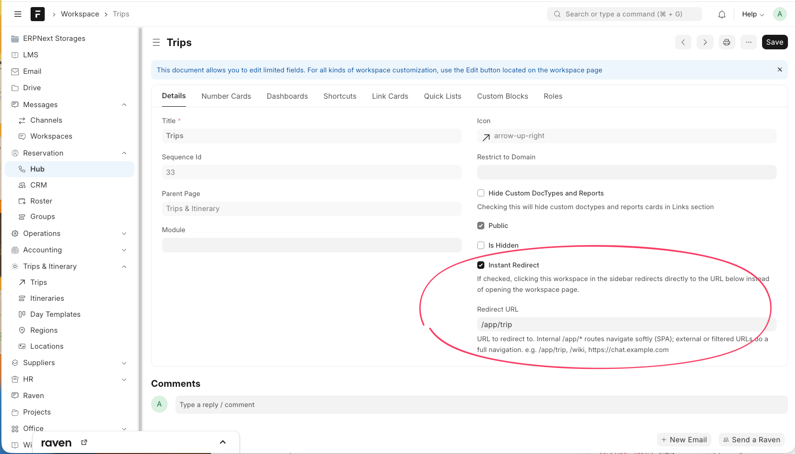

<div align="center">

# Desk Rail

### A persistent workspace navigation rail & instant-redirect navigation for the Frappe / ERPNext desk.

[](https://www.gnu.org/licenses/agpl-3.0)
[](https://frappeframework.com)
[](https://batchnepal.com)
[](CONTRIBUTING.md)

Replace the page-scoped Frappe workspace sidebar with a **fixed left rail that stays put across workspace, list and form views** — with soft SPA navigation, per-user show/hide, and workspaces that redirect anywhere. Zero core patches. One settings page.

</div>

---

## Why

Out of the box, the Frappe desk sidebar lives *inside* the workspace page — so it disappears the moment you open a list or a form, and every workspace must point at a workspace page. Teams that use the desk as their daily driver want the opposite: a navigation rail that is **always there**, that can route a sidebar item straight to a doctype list, a Frappe web page, or an external tool, and that feels like a modern SPA rather than a full page reload.

Desk Rail delivers exactly that, as a drop-in app — no forking Frappe, no template overrides.

## Features

| | |
|---|---|
| 🧭 **Persistent rail** | A fixed left sidebar mounted on the desk shell. It survives every route — workspace, list, report, form — and never rebuilds on navigation. |
| ⚡ **Soft SPA navigation** | Internal `/app/*` targets route through the Frappe router (no reload, soft back button). Only genuinely external/filtered targets do a full navigation. |
| 🔀 **Instant-redirect workspaces** | Flag any workspace and point it at any URL — a doctype list (`/app/trip`), a Frappe page (`/wiki`), or an external app (`https://chat.example.com`). |
| 👁️ **Persistent show/hide** | A toggle to the left of the navbar logo collapses/expands the rail. The choice is remembered per user, per browser. |
| 🌳 **Nested workspaces** | Parent/child workspaces render as expandable groups; the expanded state persists and auto-opens to the active page. |
| 📱 **Responsive** | On phones the rail becomes an off-canvas overlay that opens on demand and closes after you tap a link. |
| 🎛️ **Configurable** | Every behaviour is a toggle in **Desk Rail Settings** — width, native-sidebar replacement, full-width navbar, list filter-bar hiding, and more. |
| 🧩 **Non-invasive** | Pure additive JS/CSS on the desk shell plus two Workspace custom fields. Disable the app and the stock desk returns untouched. |

## Screenshots

> _Add your screenshots to `docs/` and reference them here._

| Rail across views | Instant-redirect config | Settings |
|---|---|---|
|  |  |  |

## How it works

```
┌──────────────────────────────────────────────────────────────┐
│ navbar  [☰] brand              search            user ▾        │  ← full-width, toggle left of logo
├───────────────┬──────────────────────────────────────────────┤
│  Desk Rail    │                                                │
│  (fixed,      │   #body  →  workspace / list / form            │
│   persistent) │            (page content swaps here)           │
│   Trips       │                                                │
│   ▾ Suppliers │                                                │
│     Hotels →  │                                                │
│   Reports     │                                                │
└───────────────┴──────────────────────────────────────────────┘
```

- **`boot.py`** injects `frappe.boot.desk_rail` (your settings) and `frappe.boot.redirect_workspaces` (the `{workspace: url}` map) into the desk bootinfo.
- **`desk_rail.js`** mounts the rail onto `.main-section` (the desk shell, *outside* the page container), so page swaps never touch it. It reads the workspace tree from the same API the native sidebar uses, then renders links wired to a soft/hard `navigate()` router.
- **`desk_rail.css`** styles are all gated behind body classes that the JS toggles from settings — turn a feature off and its CSS disappears too.
- **Two Workspace custom fields** (`instant_redirect`, `redirect_url`) drive the redirect map; they ship as fixtures.

Nothing here monkey-patches Frappe internals — it composes with the stock desk and degrades to the native sidebar if anything fails to load.

## Installation

Requires a working [Frappe Bench](https://frappeframework.com/docs/user/en/installation) (v14 or v15).

```bash
# from your bench directory
bench get-app https://github.com/BatchNepal/desk-rail
bench --site your-site.local install-app desk_rail
bench build --app desk_rail
bench --site your-site.local clear-cache
```

Then hard-refresh the desk (Ctrl/Cmd-Shift-R).

## Configuration

Open **Desk Rail Settings** (search the awesome bar) — a single doctype:

| Setting | Default | Description |
|---|---|---|
| **Enable Desk Rail** | ✅ | Master switch. Off → stock Frappe desk. |
| **Replace native sidebar** | ✅ | Hide the native workspace sidebar; rail takes over everywhere. Off → redirects still work on the native sidebar. |
| **Rail width (px)** | `274` | Width of the rail. |
| **Show navbar toggle** | ✅ | Show the show/hide button left of the logo (state persists per user). |
| **Collapsed by default on mobile** | ✅ | Start collapsed on phones. |
| **Full-width navbar** | ✅ | Let navbar content span edge to edge. |
| **Hide list filter bar** | ☐ | Hide the inline standard-filter row in list views (the Filter button stays). |

Changes take effect on the next desk load (the app busts the boot cache on save).

## Instant-redirect workspaces

1. Open any **Workspace** (`/app/workspace`).
2. Tick **Instant Redirect** and set **Redirect URL**.
3. Save. Clicking that workspace in the rail now goes straight to the URL.

The router is smart about *how* it navigates:

| Redirect URL | Navigation |
|---|---|
| `/app/trip`, `/app/communication/view/list` | **Soft** SPA route — no reload, rail stays mounted, back button is soft. |
| `https://chat.example.com`, `/wiki`, `/drive`, `/app/supplier?status=Active` | **Hard** navigation (cross-origin, non-desk, or filtered). |

## Compatibility

- **Frappe / ERPNext:** v14 and v15.
- Leans on stable Frappe APIs (`frappe.desk.desktop.get_workspace_sidebar_items`, `frappe.router`, `frappe.utils.icon`) and desk DOM hooks. Pin-test before adopting on a substantially different fork.

## Uninstall

```bash
bench --site your-site.local uninstall-app desk_rail
```

The stock desk returns immediately; the two Workspace custom fields are removed with the app.

## Contributing

Issues and PRs are welcome — see [CONTRIBUTING.md](CONTRIBUTING.md) and our [Code of Conduct](CODE_OF_CONDUCT.md).

## License

[GNU Affero General Public License v3.0](LICENSE) — strong copyleft; networked use counts as distribution.

## Credits

Built and maintained by **[BatchNepal](https://batchnepal.com)** — ERP, automation, and bespoke Frappe apps.
Born out of real desk-UX work for [Freedom Adventures](https://freedomadventuretreks.com).

<div align="center">
<sub>If Desk Rail makes your desk nicer to live in, a ⭐ on the repo is appreciated.</sub>
</div>
